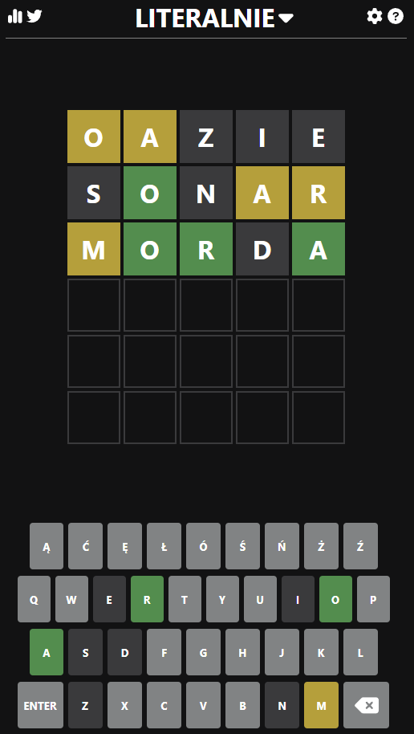
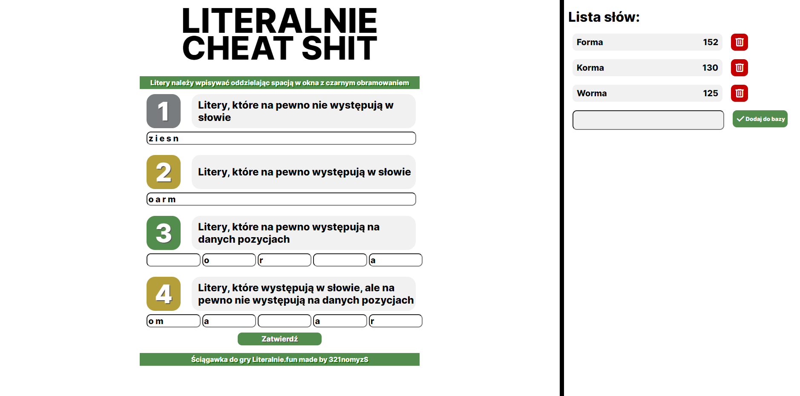

# Wordle/Literalnie PL Calculator

## Project Overview 🌟

This project serves as a sophisticated tool for calculating the best possible word guess in the Wordle or Literalnie game specifically tailored for the Polish language. It is an assistant that evaluates the information provided about the current state of the word and suggests the most strategic choice for the next move. Words are ranked based on the frequency of letters they contain in the Polish language and whether they are in the nominative case, which is a requirement for words to be valid solutions in Wordle/Literalnie.

A significant feature of this project is the implementation of Morfeusz2, a comprehensive tool for the morphological analysis of Polish language, which allows for the identification of word formations including grammatical cases. This feature is crucial for the app's functionality as it ensures the accuracy of the word analysis.

## Screenshot

Here is a screenshot of the application in action:

  
  

## Technologies 🛠️

The project is crafted using the Django framework and there are plans to expand its capabilities to include other word games.

## Features ✨

- Input letters that definitely do not appear in the word.
- Input letters that are certainly in the word but their exact positions are unknown.
- Input letters that are confirmed to be in specific positions.
- Analysis of letter frequency within the Polish language.
- Verification of words being in the nominative case to comply with Wordle/Literalnie rules.
- Advanced word-formation analysis utilizing Morfeusz2.

## Requirements 📋

- Python (specified version)
- Django (specified version)
- Morfeusz2 library

## Installation 🔧

1. Clone the repository to your local machine.
2. Install the required dependencies with `pip install -r requirements.txt`.
3. Launch the Django server using `python manage.py runserver`.

## Usage 🎮

To use the Wordle/Literalnie PL calculator:

1. Open the main page of the application.
2. Enter the known information about the word as per the instructions on the site.
3. Submit the data to receive the suggested optimal word for your game.

## License 📄

Specify the type of license under which the project is released (e.g., MIT, GPL).

## Contributions 🤝

If you are interested in contributing to the project, please reach out.

---

The project is continuously evolving, and all suggestions and contributions are welcome!
